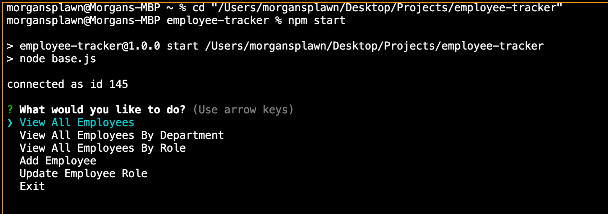
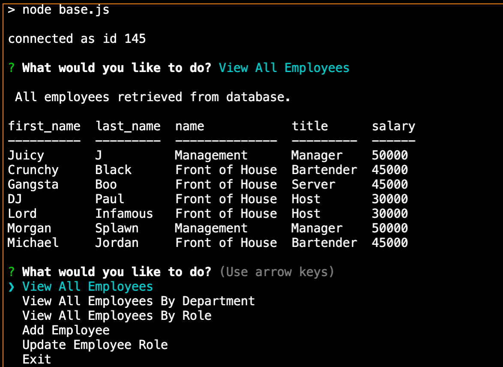
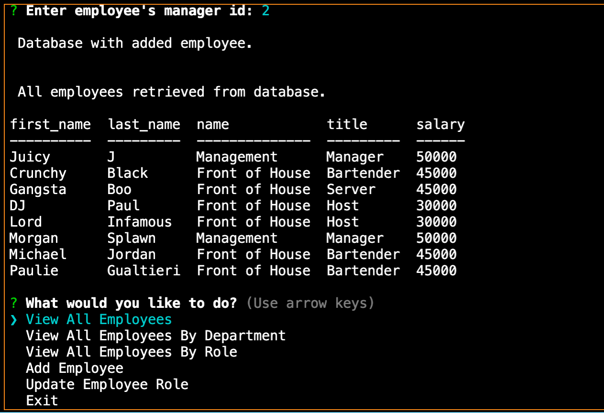

# Employee Tracker

# **Project Description**
For this project I built a command line application that creates a database of employees using MySQL. Upon starting the application users are given the option to view all employees, view employees by role, view employees by department, or update the employee's department. After selecting any option and answering any prompted questions the user will see the updated database.

# **Screencaps:**
  

   

  

# **Demo Video:**
[https://drive.google.com/file/d/1VO52mQUPWx5ogTRjguEUxOVau_boPYm3/view]

# **Installation**
Download the zip file and unzip it. Open the files and run npm install to intall the required dependencies. Then run npm start and answer the prompted questions. Upon completing a prompt you will see the desired feedback in your console!

# **Technology Stack**
* MySQL
* JavaScript
* Node
* Inquirer
* Path

# **Contact**
* ### **Name:**  Morgan Splawn
* ### **Github:**  [@msplawn](https://github.com/msplawn)
* ### **Email:**  [mmsplawn@gmail.com](msplawn@gmail.com)
* ### **LinkedIn:**  [https://www.linkedin.com/in/morgan-splawn-72979a1a9/](https://www.linkedin.com/in/morgan-splawn-72979a1a9/)
